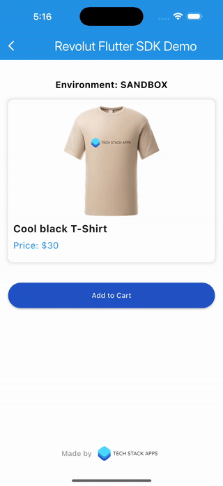

<h1 align="center" style="border-bottom: none">
  

    <a href="https://www.techstackapps.com">
      
       
    </a>
    Revolut Flutter SDK
  

</h1>

  
  
  
  

### One click solution support for:

- `Card Payments`: Master card, VISA
- `Revolut Pay`
- `Apple Pay`
- `Google Pay` (planned, currently its not supported)

## Getting started

  <a href="https://revolutfluttersdk.com" target="_blank" style="text-decoration: none;">
    <button style="
      background-color: #2052C5;
      color: white;
      padding: 12px 20px;
      font-size: 16px;
      border: none;
      border-radius: 5px;
      cursor: pointer;">
      🛒 Get Revolut Flutter SDK
    </button>
  </a>

## Give it a try, use [example app](./example/)  
- Use the [example app](./example/) to explore the SDK's functionality.  
- Follow the [**README.md**](./example/README.md) instructions inside the [example folder](./example/)  for a smooth setup.

---

## Requirements

### [Merchant account on Revolut Business](https://business.revolut.com/signup?promo=referabusiness&ext=26cc1652-6fa0-4911-9149-b46c49d32d30&context=B2B_REFERRAL)

To accept payments with `Revolut`, you’ll need a [Revolut Business](https://business.revolut.com/signup?promo=referabusiness&ext=26cc1652-6fa0-4911-9149-b46c49d32d30&context=B2B_REFERRAL), and [Revolut Business Merchant account](https://business.revolut.com/signup?promo=referabusiness&ext=26cc1652-6fa0-4911-9149-b46c49d32d30&context=B2B_REFERRAL) from which you can get the `Merchant ID`.

<table>
  <tr>
    <td style="padding: 10px 0;">
      Don’t have a Revolut Business account yet?
    </td>
    <td>
      <a href="https://business.revolut.com/signup?promo=referabusiness&ext=26cc1652-6fa0-4911-9149-b46c49d32d30&context=B2B_REFERRAL" target="_blank" style="text-decoration: none;">
        <button style="
          background-color: #2052C5;
          color: white;
          padding: 10px 18px;
          font-size: 16px;
          border: none;
          border-radius: 5px;
          cursor: pointer;">
          🚀 Sign Up for Revolut Business
        </button>
      </a>
    </td>
  </tr>
</table>

---

## Payment Methods
This SDK provides multiple ways to accept payments to your **Revolut Business** account:  

- `Card Payments`.
- `Revolut Pay` – a seamless checkout experience within the `Revolut` app.
- `Apple Pay` – allowing customers to pay effortlessly using their Apple devices.
- `Google Pay` – (comming soon, officialy is not supported yet).

This ensures a smooth and flexible payment experience for your customers. 🎯

## Description

This SDK simplifies integrating [Revolut’s Payment Gateway](https://www.revolut.com/business/payment-gateway/) into your `Flutter` applications, simplifying the acceptance of payments for [Revolut Business](https://business.revolut.com/signup?promo=referabusiness&ext=26cc1652-6fa0-4911-9149-b46c49d32d30&context=B2B_REFERRAL).

The package wraps existing native SDKs for `Android` and `iOS`, including specific support for packages such as `Card Payments`, `Revolut Payments`. It streamlines initiating payments and interacting seamlessly with the Revolut backend to verify payment statuses.

## Card Payment

Securely process debit and credit card payments using `Revolut`'s payment infrastructure. Supports multiple currencies and real-time transaction processing.

## Revolut Pay

Offer a seamless checkout experience with `Revolut Pay`, allowing users to pay directly from their `Revolut` accounts with instant confirmation.

## Apple Pay

Enable `Apple Pay` for fast, secure, and contactless payments on `iOS ` devices, providing a frictionless checkout experience for customers.

## Google Pay (cooming soon)

Enable `Google Pay` for fast, secure, and contactless payments on `Android` devices, providing a frictionless checkout experience for customers.

Not available at this moment, waiting for [Revolut Business](https://business.revolut.com/signup?promo=referabusiness&ext=26cc1652-6fa0-4911-9149-b46c49d32d30&context=B2B_REFERRAL) team to make it officially availablein the official native `SDK`.

Some helpful links:
- More information on the [Merchant API](https://developer.revolut.com/docs/accept-payments/)
- [API Reference](https://developer.revolut.com/docs/api-reference/merchant)

### Minimum supported versions

|         |            Version |
|---------|-------------------:|
| Dart    |              3.2.0 |
| Flutter |              3.3.0 |
| Android | 5.0 (Api level 21) |
| iOS     |                 13 |