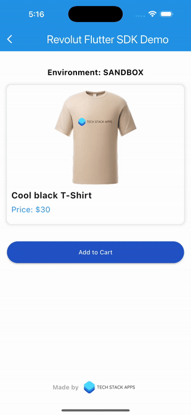
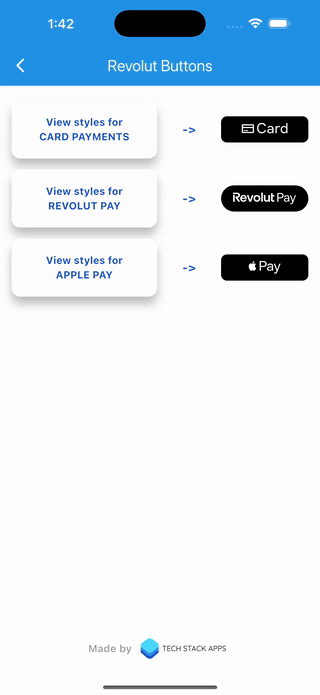
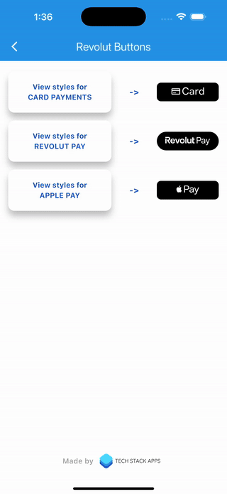

<h1 align="center" style="border-bottom: none">
  <div>
    <a href="https://www.techstackapps.com">
      
      <br>
    </a>
    Revolut Flutter SDK
  </div>
</h1>


<p align="center">
  <a href="../changelog.md">
    
  </a>
    <a href="https://www.youtube.com/watch?v=Ss7PG-g3B2g">
    
  </a>
  <a href="https://www.linkedin.com/company/techstackapps/">
    
  </a>
  <a href="https://x.com/techstackapps">
    
  </a>
</p>


## Installation

To access the private repository, you need to add the received authentication `token`

<p align="left">
  <a href="https://revolutfluttersdk.com" target="_blank" style="text-decoration: none;">
    <button style="
      background-color: #2052C5;
      color: white;
      padding: 12px 20px;
      font-size: 16px;
      border: none;
      border-radius: 5px;
      cursor: pointer;">
      🛒 Get the TOKEN
    </button>
  </a>
</p>

### 1. Run the following command to add the token:
```sh
  echo 'YOUR_TOKEN' | dart pub token add https://dart.cloudsmith.io/techstackapps/revolut-flutter-sdk/
```

### 2. Add the package dependency
You can add the required package to your project by executing:

- General installation:
```sh
  dart pub add flutter_revolut --hosted-url https://dart.cloudsmith.io/techstackapps/revolut-flutter-sdk/
  ```
- Installing a specific version:
```sh
  dart pub add flutter_revolut:1.3.0 --hosted-url https://dart.cloudsmith.io/techstackapps/revolut-flutter-sdk/
  ```

This will automatically update your `pubspec.yaml` file with the new dependency:
```yaml
dependencies:
  flutter:
    sdk: flutter
  flutter_revolut:
    hosted: https://dart.cloudsmith.io/techstackapps/revolut-flutter-sdk/
    version: ^1.3.0
```

## Requirements

For `iOS` you also have to change the `Podfile` in the `ios` folder of your project so that `CocoaPods` installs the pod for this package as static:

```
platform :ios, '13.0'

target 'Runner' do
  use_frameworks! :linkage => :static

  flutter_install_all_ios_pods File.dirname(File.realpath(__FILE__))
end
```

## Usage
This `SDK` offers two different ways of accepting payments made to your Business account: directly accepting a card payment, or accepting a payment through the `Revolut` app using `Revolut Pay`.

Before everything, you need to be aware of your Merchant API keys. The public key will be used to initialise the SDK, while the secret key will be used as authorisation for the API calls.

To initialise the package in your `Flutter` app, use the `RevolutPayment` base class. First set the `merchantPublicKey` and the `environment`, which is either `RevolutEnvironment.SANDBOX` or `RevolutEnvironment.PRODUCTION`, then call the `applySettings()` function:

```dart
RevolutPayment.environment = RevolutEnvironment.[ENV];
RevolutPayment.merchantPublicKey ="[publicKey]";
await  RevolutPayment.instance.applySettings();
``` 

## Run
This package comes with an example application that presents the functionality of both payment methods in a straightforward manner. To run it:
```sh
cd example
flutter pub get
flutter run 
```

## Payment flow

After initialisation, when you want to accept a payment in your app the first thing you need to do is create an order on the `Revolut` backend with the needed amount and currency:
```
curl -X "POST" "https://merchant.revolut.com/api/1.0/orders" \
   -H 'Authorization: Bearer [secretKey]' \
   -H 'Content-Type: application/json; charset=utf-8' \
   -d $'{
     "amount": 100,
     "currency": "GBP"
    }'
```

The API will return a `JSON` when the order is successfully created from which you need the `public_id` in order to start a payment.

The next steps are different for the two ways of accepting payments.

### 1. Card payment



<br>

In order to accept direct card payments, you need to call the `startCardPayment(orderId, configuration)` asynchronous function. This will bring up the payment screen where the user can enter their card information. The function returns the `"authorised"` string if successful or throws a `RevolutCardPaymentException` for all failure cases.

The parameters:
- `orderId` is the above-mentioned public_id of the order 
-  `configuration` is an object of type `CardPaymentConfiguration` that is optional and passes the e-mail and address of the user

Usage example:
```dart
try {
	await  RevolutPayment.instance.startCardPayment(
		orderId: revolutOrderId,
		//configuration is optional
		configuration: CardPaymentConfiguration(
			email: email,
			billingAddress: CardBillingAddress(
				streetLine1: line1,
				streetLine2: line2,
				city: city,
				region: region,
				countryIsoCode: isoCode,
				postcode: postCode)));
	//success case
} catch (e) {
	if (e  is  RevolutCardPaymentException) {
		//payment failure case
	} else {
		//general failure case
	}
}
```

Or you can use the pre-build button:
```dart
RevolutCardButton(
    orderPublicId: revolutOrderId,
    buttonRadius: ButtonRadius.full,
    buttonSize: ButtonSize.fullWidth,
    customIconSize: 23,
    onSucceeded: (){},
    //configuration is optional
    configuration: CardPaymentConfiguration(
        email: email,
        billingAddress: CardBillingAddress(
            streetLine1: line1,
            streetLine2: line2,
            city: city,
            region: region,
            countryIsoCode: isoCode,
            postcode: postCode,
        ),
    ),
),
```

### 2. Revolut Pay


<br>

This payment method lets the user make payments more easily using their `Revolut` account, if they have one. To add this functionality to your app you only need to add the `RevolutPayButton` widget to your screen. When the user taps the button there are two possible things that can happen:
- if the `Revolut` app is installed on their phone, the user is taken to it and can pay there
- if the `Revolut` app is not installed, the user is taken to a webview with a card form similar to the other payment method
(this is true only for the production environment, in sandbox the user is never taken to the `Revolut` app even if it's installed)

If the payment is successful, the widget calls the `onSucceeded` void callback. If it fails for whatever reason, it calls the `onFailed(errorMessage)` callback. You need to provide these callbacks when you instantiate the button.

> ℹ️ **Info:**  
> To test Revolut Pay in the [sandbox environment](https://sandbox-business.revolut.com/), you must use the Simulator.

Usage example of the native button:
```dart
RevolutPayButton(
	orderPublicId: revolutOrderId,
	height: height,
	width: width,
	buttonParams: RevolutPayButtonParams(
		radius: RevolutPayRadius.LARGE,
		size: RevolutPaySize.MEDIUM,
		//lightMode and darkMode are optional
		lightMode: RevolutPayVariant.LIGHT_OUTLINED,
		darkMode: RevolutPayVariant.DARK_OUTLINED),
	onSucceeded: () {
		//success case
	},
	//onFailed is optional
	onFailed: (message) {
		//failure case
	}
)
```

Or you can use a custom flutter button for Revolut Pay:
```dart
CustomRevolutPayButton(
  orderPublicId: revolutOrderId,
  buttonRadius: ButtonRadius.full,
  buttonSize: ButtonSize.fullWidth,
  iconSize: IconSize.large,
  onSucceeded: (){},
  onFailed: (msg) {},
),
```

### 3. Apple Pay


<br>

The `SDK` also offers the possibility of checking if the `Revolut` app is installed on the user's device using the `isRevolutAppInstalled()` function which returns a `bool`.

> ℹ️ **Info:**  
> Apple Pay is not available in the [sandbox environment](https://sandbox-business.revolut.com/). Real transactions must be made to test your implementation in the `production environment`.

#### Implementation Overview for Apple Pay

Follow this high-level guide to implementing the Apple Pay button in your iOS app.

#### 1. Create a Merchant Identifier

- Log in to your [Apple Developer Account](https://developer.apple.com/account/).
- Navigate to **Certificates, Identifiers & Profiles**.
- Under **Identifiers**, select **Merchant IDs**.
- Click the **+** button to create a new Merchant ID.
- Follow the prompts to create your Merchant Identifier (e.g., `merchant.com.yourappname`).

---

#### 2. Create an Apple Pay Certificate

To process payments with Apple Pay, you need an **Apple Pay Payment Processing Certificate** associated with your Merchant Identifier.

#### Steps:

- Request a **Certificate Signing Request (CSR)** file from Revolut by emailing [merchant-integration@revolut.com](mailto:merchant-integration@revolut.com).
- Use the provided **CSR file** to create an **Apple Pay Payment Processing Certificate** in the Apple Developer portal.
- In your **Apple Developer Account**:
  - Go to **Certificates, Identifiers & Profiles**.
  - Select your **Merchant ID**.
  - Click **Create Certificate** under the **Apple Pay Payment Processing Certificate** section.
- Follow the instructions to:
  - Upload the **CSR file**.
  - Download the generated certificate (`.cer` file).
- Send the **certificate (`.cer` file)** to Revolut by emailing it back to [merchant-integration@revolut.com](mailto:merchant-integration@revolut.com).

> ⚠️ **Caution:**  
> - This step is **not automated**.  
> - You must use **only one certificate** per Merchant ID.  
> - If you want to change the **Merchant ID** or if the certificate is about to **expire**, you must repeat this process.

---

#### 3. Add the Apple Pay Capability to Your Project

To enable Apple Pay in your Xcode project:

- Open your **project in Xcode**.
- Select your **project** in the **Project Navigator**.
- Go to the **Signing & Capabilities** tab.
- Click the **+ Capability** button.
- Add the **Apple Pay** capability.
- Select the **Merchant ID** you created earlier.

> ℹ️ **Info:**  
> For more details, check Apple's documentation on [Adding Apple Pay Capabilities](https://developer.apple.com/documentation/passkit/apple_pay/setting_up_apple_pay).

---

This formatting improves readability, makes instructions clearer with bullet points, and includes emphasis for important parts. Let me know if you need any further refinements! 🚀

For `Apple Pay` add to your `Info.plist` file:
```xml
<key>NSMerchantIdentifier</key>
<string>merchant.com.yourappnamep</string>
```

Usage example of the native button:
```dart
RevolutApplePayButton(
    orderId: revolutOrderId,
    amount: amount,
    currency: currency,
    buttonStyle: RevolutApplePayButtonStyle.white,
),
```

Or you can use a custom flutter button for Apple Pay:
```dart
CustomRevolutApplePayButton(
    orderPublicId: revolutOrderId,
    amount: widget.amount,
    currency: widget.currency,
    buttonRadius: ButtonRadius.full,
    buttonSize: ButtonSize.fullWidth,
    iconSize: IconSize.large,
    onSucceeded: (){},
)
```


### Supported button styles

Below are presented the Flutter buttons:


### Card Button Styles

<table>
  <tr>
    <td style="vertical-align: top;">
      
    </td>
    <td style="vertical-align: top;">
      <pre>
      <code style="text-align: left; display: block;">
<span style="color:#3fb950;">RevolutCardButton</span>(
    <span style="color:#ff7b72;">orderPublicId</span>: revolutOrderId, // <span style="color:#dcdcaa;">String</span>: The order ID associated with Revolut order ID.
    <span style="color:#ff7b72;">buttonRadius</span>: <span style="color:#79c0ff;">ButtonRadius</span>.full, // <span style="color:#dcdcaa;">ButtonRadius</span>: Defines button corner radius (e.g., small, full).
    <span style="color:#ff7b72;">buttonSize</span>: <span style="color:#79c0ff;">ButtonSize</span>.fullWidth, // <span style="color:#dcdcaa;">ButtonSize</span>: Defines button size (e.g., small, large, fullWidth).
    <span style="color:#ff7b72;">configuration</span>: <span style="color:#79c0ff;">CardPaymentConfiguration</span>(), // <span style="color:#dcdcaa;">CardPaymentConfiguration?</span>: (Optional) Configuration for card payments.
    <span style="color:#ff7b72;">customIconSize</span>: 23, // <span style="color:#dcdcaa;">double?</span>: (Optional) Custom icon size override.
    <span style="color:#ff7b72;">onSucceeded</span>: _onSucceeded, // <span style="color:#dcdcaa;">VoidCallback?</span>: Callback triggered when payment succeeds.
    <span style="color:#ff7b72;">onFailed</span>: (msg) {}, // <span style="color:#dcdcaa;">VoidCallback?</span>: (Optional) Callback triggered when payment fails.
    <span style="color:#ff7b72;">variant</span>: <span style="color:#79c0ff;">ButtonVariant</span>.dark, // <span style="color:#dcdcaa;">ButtonVariant</span>: Defines button style (e.g., dark, lightWithBorder).
    <span style="color:#ff7b72;">customWidth</span>: 200, // <span style="color:#dcdcaa;">double?</span>: (Optional) Custom width override.
    <span style="color:#ff7b72;">customHeight</span>: 50, // <span style="color:#dcdcaa;">double?</span>: (Optional) Custom height override.
    <span style="color:#ff7b72;">customRadius</span>: 10, // <span style="color:#dcdcaa;">double?</span>: (Optional) Custom border radius override.
)
      </code>
      </pre>
    </td>
  </tr>
</table>

### Revolut Pay Button Styles

<table>
  <tr>
    <td style="vertical-align: top;">
      
    </td>
    <td style="vertical-align: top;">
      <pre>
      <code style="text-align: left; display: block;">
<span style="color:#3fb950;">CustomRevolutPayButton</span>(
    <span style="color:#ff7b72;">orderPublicId</span>: revolutOrderId, // <span style="color:#dcdcaa;">String</span>: The order ID associated with Revolut order ID.
    <span style="color:#ff7b72;">buttonRadius</span>: <span style="color:#79c0ff;">ButtonRadius</span>.full, // <span style="color:#dcdcaa;">ButtonRadius</span>: Defines button corner radius (e.g., small, full).
    <span style="color:#ff7b72;">buttonSize</span>: <span style="color:#79c0ff;">ButtonSize</span>.fullWidth, // <span style="color:#dcdcaa;">ButtonSize</span>: Defines button size (e.g., small, large, fullWidth).
    <span style="color:#ff7b72;">iconSize</span>: <span style="color:#79c0ff;">IconSize</span>.large, // <span style="color:#dcdcaa;">IconSize</span>: Defines icon size (e.g., small, large).
    <span style="color:#ff7b72;">onSucceeded</span>: (){}, // <span style="color:#dcdcaa;">VoidCallback</span>: Callback triggered when payment succeeds.
    <span style="color:#ff7b72;">onFailed</span>: (msg) {}, // <span style="color:#dcdcaa;">void Function(String)?</span>: (Optional) Callback triggered when payment fails.
    <span style="color:#ff7b72;">buttonIconType</span>: <span style="color:#79c0ff;">ButtonIconType</span>.ios, // <span style="color:#dcdcaa;">ButtonIconType</span>: Defines the button icon / logo to be used.
    <span style="color:#ff7b72;">variant</span>: <span style="color:#79c0ff;">ButtonVariant</span>.dark, // <span style="color:#dcdcaa;">ButtonVariant</span>: Defines button style (e.g., dark, lightWithBorder).
    <span style="color:#ff7b72;">customWidth</span>: 200, // <span style="color:#dcdcaa;">double?</span>: (Optional) Custom width override.
    <span style="color:#ff7b72;">customHeight</span>: 50, // <span style="color:#dcdcaa;">double?</span>: (Optional) Custom height override.
    <span style="color:#ff7b72;">customRadius</span>: 10, // <span style="color:#dcdcaa;">double?</span>: (Optional) Custom border radius override.
    <span style="color:#ff7b72;">customIconSize</span>: 30, // <span style="color:#dcdcaa;">double?</span>: (Optional) Custom icon size override.
)
      </code>
      </pre>
    </td>
  </tr>
</table>

### Apple Pay Button Styles

<table>
  <tr>
    <td style="vertical-align: top;">
      
    </td>
    <td style="vertical-align: top;">
      <pre>
      <code style="text-align: left; display: block;">
<span style="color:#3fb950;">CustomRevolutApplePayButton</span>(
    <span style="color:#ff7b72;">orderPublicId</span>: revolutOrderId, // <span style="color:#dcdcaa;">String</span>: The order ID associated with Revolut order ID.
    <span style="color:#ff7b72;">amount</span>: 1000, // <span style="color:#dcdcaa;">int</span>: Payment amount in minor units (e.g., cents).
    <span style="color:#ff7b72;">currency</span>: "USD", // <span style="color:#dcdcaa;">String</span>: The currency code.
    <span style="color:#ff7b72;">buttonRadius</span>: <span style="color:#79c0ff;">ButtonRadius</span>.full, // <span style="color:#dcdcaa;">ButtonRadius</span>: Defines button corner radius (e.g., small, full).
    <span style="color:#ff7b72;">buttonSize</span>: <span style="color:#79c0ff;">ButtonSize</span>.fullWidth, // <span style="color:#dcdcaa;">ButtonSize</span>: Defines button size (e.g., small, large, fullWidth).
    <span style="color:#ff7b72;">iconSize</span>: <span style="color:#79c0ff;">IconSize</span>.large, // <span style="color:#dcdcaa;">IconSize</span>: Defines icon size (e.g., small, large).
    <span style="color:#ff7b72;">onSucceeded</span>: (){}, // <span style="color:#dcdcaa;">VoidCallback</span>: Callback triggered when payment succeeds.
    <span style="color:#ff7b72;">onFailed</span>: (msg) {}, // <span style="color:#dcdcaa;">void Function(String)?</span>: (Optional) Callback triggered when payment fails.
    <span style="color:#ff7b72;">variant</span>: <span style="color:#79c0ff;">ButtonVariant</span>.dark, // <span style="color:#dcdcaa;">ButtonVariant</span>: Defines button style (e.g., dark, lightWithBorder).
    <span style="color:#ff7b72;">customWidth</span>: 200, // <span style="color:#dcdcaa;">double?</span>: (Optional) Custom width override.
    <span style="color:#ff7b72;">customHeight</span>: 50, // <span style="color:#dcdcaa;">double?</span>: (Optional) Custom height override.
    <span style="color:#ff7b72;">customRadius</span>: 10, // <span style="color:#dcdcaa;">double?</span>: (Optional) Custom border radius override.
    <span style="color:#ff7b72;">customIconSize</span>: 30, // <span style="color:#dcdcaa;">double?</span>: (Optional) Custom icon size override.
)
      </code>
      </pre>
    </td>
  </tr>
</table>


### Support the Revolut App URL scheme
If you want the widget to be able to open the `Revolut` app you need to add the relevant URL scheme to your application:

For `Android` you need to add the following to your `AndroidManifest.xml`:
```xml
<queries>
    <package android:name="com.revolut.revolut" />
</queries>
```

For `iOS` add to your `Info.plist` file:
```xml
<key>LSApplicationQueriesSchemes</key>
<array>
    <string>revolut</string>
</array>
```